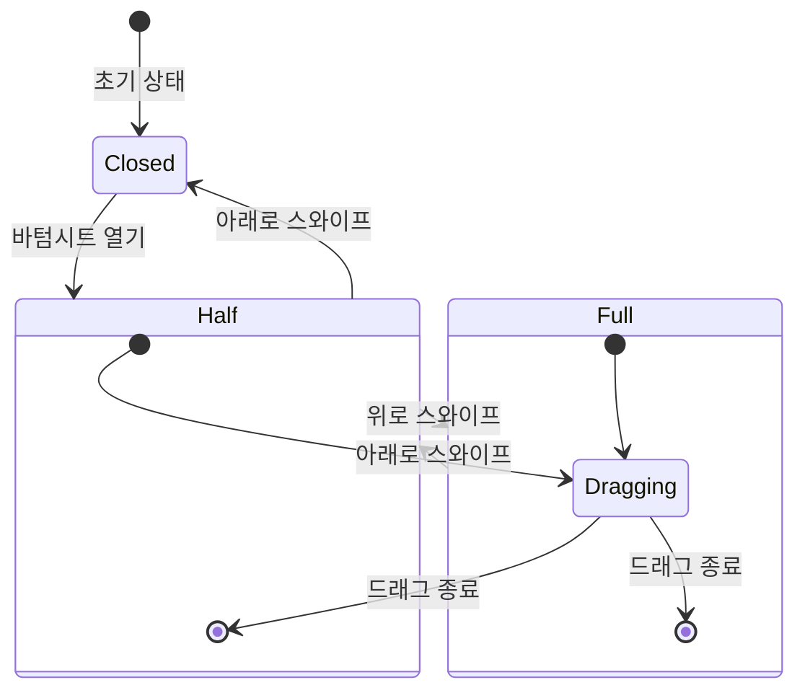
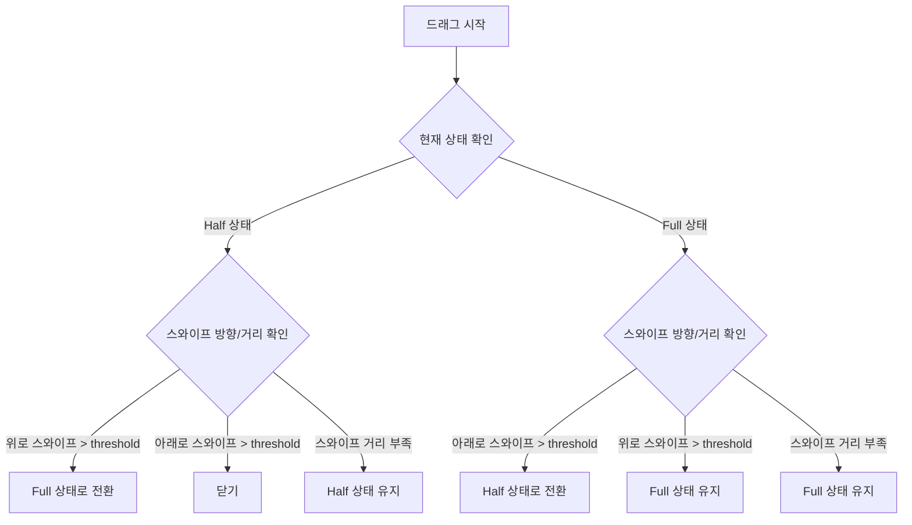

# Vue Bottom Sheet Component

- 모바일 환경에서 사용할 수 있는 바텀시트 컴포넌트입니다. 
- 드래그와 스와이프 제스처를 통해 바텀시트를 닫거나 확장할 수 있습니다.

<br/><br/>

## 기능

- 드래그로 바텀시트 높이 조절
- 스와이프로 상태 전환 (half/full/closed)
- 모바일 터치 최적화

<br/>

### 상태 다이어그램



<br/>

### 동작 흐름도



<br/><br/>

## 코드 구조

### 1. 상태 관리

```typescript
// 바텀시트 상태
type SheetState = 'closed' | 'half' | 'full'
const currentState = ref<SheetState>('half')

// 드래그 관련 상태
const translateY = ref(0)          // Y축 이동 거리
const isDragging = ref(false)      // 드래그 중 여부
const startY = ref(0)              // 드래그 시작 Y 좌표
const startTranslateY = ref(0)     // 시작 translateY 값
const startTime = ref(0)           // 드래그 시작 시간
```

<br/>

### 2. 주요 이벤트 핸들러

#### 2.1 드래그 시작 (startDrag)
```typescript
const startDrag = (e: MouseEvent | TouchEvent) => {
  isDragging.value = true
  startY.value = e.touches[0].clientY
  startTranslateY.value = translateY.value
  startTime.value = performance.now()
}
```
- 드래그 상태 초기화
- 시작 위치와 시간 기록
- 터치 이벤트 기본 동작 방지

<br/>

#### 2.2 드래그 중 (onDrag)
```typescript
const onDrag = (e: MouseEvent | TouchEvent) => {
  const deltaY = e.touches[0].clientY - startY.value
  translateY.value = startTranslateY.value + deltaY
}
```
- 현재 위치 계산
- 이동 범위 제한 (0 ~ sheetHeight)
- 부드러운 이동 처리

<br/>

#### 2.3 드래그 종료 (endDrag)
```typescript
const endDrag = () => {
  const deltaY = translateY.value - startTranslateY.value
  const velocity = Math.abs(deltaY / (performance.now() - startTime.value))
  const fastSwipe = velocity > 0.5
  const threshold = sheetHeight.value / 3

  // 상태 전환 로직
  if (currentState.value === 'full') {
    if (deltaY > threshold || (fastSwipe && deltaY > 0)) {
      currentState.value = 'half'
    }
  } else if (currentState.value === 'half') {
    if (deltaY < -threshold || (fastSwipe && deltaY < 0)) {
      currentState.value = 'full'
    } else if (deltaY > threshold || (fastSwipe && deltaY > 0)) {
      close()
    }
  }
}
```
- 스와이프 속도와 거리 계산
- 상태 전환 조건 확인
- 적절한 상태로 전환

<br/>

### 3. CSS 최적화

```css
.bottom-sheet {
  /* 기본 스타일 */
  touch-action: none;
  user-select: none;
  will-change: transform;
  
  /* 성능 최적화 */
  -webkit-overflow-scrolling: touch;
}

/* 드래그 중 transition 제거 */
.bottom-sheet.dragging {
  transition: none;
}

/* 일반 상태 transition 적용 */
.bottom-sheet:not(.dragging) {
  transition: transform 0.18s ease;
}
```

<br/>

## 주의사항

1. 모바일 환경에서 최적의 성능을 위해 다음 사항을 확인할 것
   - `touch-action: none` 설정
   - `will-change: transform` 사용
   - 불필요한 transition 제거

2. 상태 전환 시 다음 조건을 고려할 것
   - 스와이프 거리 (threshold)
   - 스와이프 속도
   - 현재 상태
